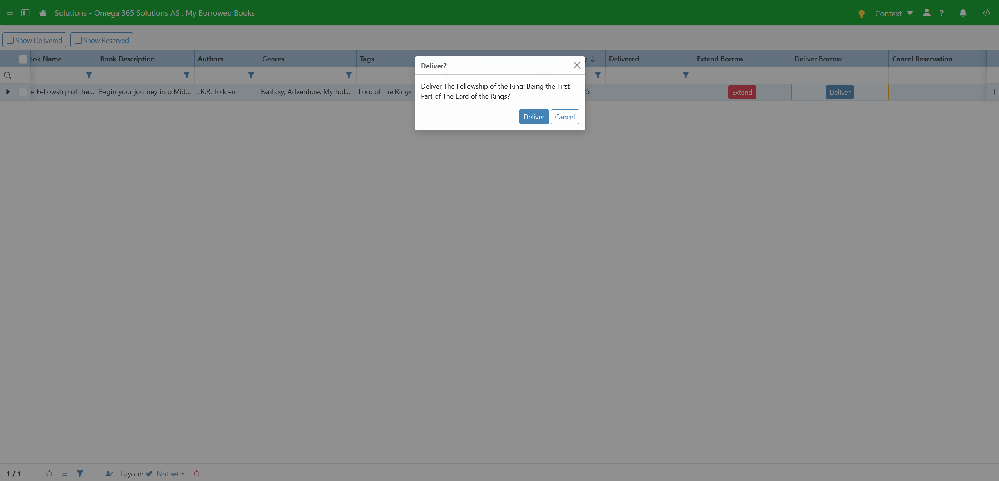

# Bruksanvisning

## Library Search And Borrow

    

        Hvordan søke etter en bok?
    

    
Når du står i appen så kan du se helt på toppen at det er en søkebar der du kan skrive inn det du ønsker å se. Når du da har trykket enter kommer det du har søkt etter opp.

    

    

        Hvordan filtrere på sjanger?
    

    
Når du står i appen så kan du se vedsiden av søkebaren er det et lite ikon av en trakt. Om du da trykker på denne får du opp forskjellige sjangere som du kan filtrere på, her kan du enter huke av forskjellige i listen, eller ende søkemåte til f.eks "Contains" og da kan du søke etter en spesifikk sjanger.

    

    

        Hvordan låne en bok?
    

    
Når du står i appen så kan du se på hver av bøkene at det er en knapp der det står "Borrow". Om du trykker på denne kommer det opp en dialog med all infoen, et dato felt der du kan legge inn hvor lenge du ønsker å låne (om du ikke fyller inn er det 7 dager), og en knapp som du trykker på for å godkjenne dette.

    
    
Når du da trykker på "Borrow" lukker dialogen seg og du får en melding om når du må huske å levere den innen.

    

        Hvordan reservere en bok?
    

    
Når du står i appen og ser en har "Available from dd/MM/yyyy" som status, så kan du se at det er en knapp som det står "Reserve" på. Om du klikker på denne får du opp en godkjenning om at du ønsker å reservere denne boken.

    
    
Når du da har trykket på "Reserve" kommer det opp en melding om hvilken plass du har i køen.

## My Borrowed Books

    

        Hvordan levere en bok?
    

    
Når du står i appen så kan du se en tabell med mange kolonner, helt til høyre i denne tabellen er det en kolonne som heter "Deliver Borrow". I denne kolonnen er det en knapp du kan trykke på. Når du har trykket på denne kommer det opp en godkjenning for at du ønsker å levere denne boken. 

    

    

        Hvordan utvide lånet på en bok?
    

    
Når du står i appen så kan du se vedsiden av "Deliver Borrow" kolonnen, en kolonne som heter "Extend Borrow". I denne kolonnen er det en knapp du kan trykke på som gir en godkjenning om at du ønsker å utvide lånet med 7 dager.

    

    

        Hvordan se reservasjoner?
    

    
Når du står i appen så kan du se helt i topp venstre hjørne at det er en knapp som heter "Show Reserved". Om du trykker på denne kommer dine reserverte bøker opp.

    

    

        Hvordan kansellere reservasjonen på en bok?
    

    
Når du står i appen og har krysset av for "Show Reserved", så kan du se en kolonne helt til høyre som heter "Cancel Reservation". Om du da trykker på denne får du opp en godkjenning på om du ønsker å kansellere.

    

    

        Hvordan se leverte bøker?
    

    
Når du står i appen så kan du se helt i topp venstre hjørne at det er en knapp som heter "Show Delivered". Om du trykker på denne kommer dine leverte bøker opp.

    

## Library Administration

    

        Hvordan lage en ny bok?
    

    
Når du står i appen ser du en tabell på venstresiden. På bunn av denne tabellen er det en rad med en oransj prikk helt til venstre, her kan du trykke inn i "Name" kolonnen for å gi en tittel. Når du er fornøyd med tittelen din trykker du vekk fra raden, så lagres den.

    

    

        Hvordan slette en bok?
    

    
Når du står i appen ser du en tabell på venstresiden. På enden av den raden du står på er det et lite kryss, om du trykker på dette krysset slettes boken.

    

    

        Hvordan endre tittel, beskrivelse eller dato?
    

    
Når du står i appen og står på en rad i tabellen, så kommer infoen om boka opp på høyreside i en detaljevisning. Her har du mulighet til å lett endre tittel, beskrivelse, ISBN, og publiseringsdato. Når du er fornøyd med endringene dine kan du trykke på "Save".

    

    

        Hvordan endre forfattere på boken?
    

    
Når du står i appen og står på en rad i tabellen, så kommer infoen om boka opp på høyeside i en detaljevisning. Her kan du se et felt som heter "Authors". Om du trykker på dette feltet kommer det opp en dialog der du kan legge til forfattere.

    
    
    
Om du trykker inn i den nye raden her får du en nedtrekksmeny med eksisterende forfattere, men om du ønsker en ny forfatter trykker du på det lille pluss tegnet helt til høyre i cellen, så kommer en liten tekstboks opp der du skriver navnet på forfatteren du ønsker å legge til. Når du da har godtjent den kommer den opp i tabellen. Når du er ferdig å legge til forfattere trykker du bare ut av dialogen, så lagres det.

    

        Hvordan endre sjangere på boken?
    

    
Når du står i appen og står på en rad i tabellen, så kommer infoen om boka opp på høyeside i en detaljevisning. Her kan du se et felt som heter "Genres". Om du trykker på dette feltet kommer det opp en dialog der du kan legge til sjangere.

    
    
    
Om du trykker inn i den nye raden her får du en nedtrekksmeny med eksisterende sjangere, men om du ønsker en ny sjanger trykker du på det lille pluss tegnet helt til høyre i cellen, så kommer en liten tekstboks opp der du skriver navnet på sjangeren du ønsker å legge til. Når du da har godtjent den kommer den opp i tabellen. Når du er ferdig å legge til sjangere trykker du bare ut av dialogen, så lagres det.

    

        Hvordan endre tags boken?
    

    
Når du står i appen og står på en rad i tabellen, så kommer infoen om boka opp på høyeside i en detaljevisning. Her kan du se et felt som heter "Tags". Om du trykker på dette feltet kommer det opp en dialog der du kan legge til tags.

    
    
    
Om du trykker inn i den nye raden her får du en nedtrekksmeny med eksisterende tags, men om du ønsker en ny tag trykker du på det lille pluss tegnet helt til høyre i cellen, så kommer en liten tekstboks opp der du skriver navnet på taggen du ønsker å legge til. Når du da har godtjent den kommer den opp i tabellen. Når du er ferdig å legge til tags trykker du bare ut av dialogen, så lagres det.

    

        Hvordan legge til bilde?
    

    
Når du står i appen og står på en rad i tabellen, så kommer infoen om boka opp på høyeside i en detaljevisning. Om det ikke ligger et bilde på boken så kommer det opp tekst der det står "No picture is uploaded for this book". Om du da trykker på denne teksten får du opp filvelgeren, eller så kan du dra en fil over teksten og slippe for å laste opp.

    

    

        Hvordan se slettede bøker?
    

    
Når du står i appen og ser oppforbi tabellen ser du en knapp som heter "Show Deleted". Om du trykker på denne kommer det opp de bøkene som er registrert som slettet.

    

    

        Hvordan administrere forfattere?
    

    
Når du står i appen og ser oppforbi tabellen ser du en nedtrekksmeny som heter "Common Tasks". I denne menyen ser du et par forskjellige knapper, blant annet en som heter "Manage Authors". Om du trykker på denne kommer det opp en dialog der du kan legge til, slette, eller endre forfattere. Når du er ferdig så bare trykker du ut av dialogen, så lagres det

    
    

    

        Hvordan administrere sjangere?
    

    
Når du står i appen og ser oppforbi tabellen ser du en nedtrekksmeny som heter "Common Tasks". I denne menyen ser du et par forskjellige knapper, blant annet en som heter "Manage Genres". Om du trykker på denne kommer det opp en dialog der du kan legge til, slette, eller endre sjangere. Når du er ferdig så bare trykker du ut av dialogen, så lagres det

    
    

    

        Hvordan administrere tags?
    

    
Når du står i appen og ser oppforbi tabellen ser du en nedtrekksmeny som heter "Common Tasks". I denne menyen ser du et par forskjellige knapper, blant annet en som heter "Manage Tags". Om du trykker på denne kommer det opp en dialog der du kan legge til, slette, eller endre tags. Her kan du også velge farge som vises i Library Search And Borrow på taggen. Når du er ferdig så bare trykker du ut av dialogen, så lagres det

    
    

    

        Hvordan importere ved bruk av ISBN?
    

    
Når du står i appen og ser oppforbi tabellen ser du en nedtrekksmeny som heter "Common Tasks". I denne menyen ser du et par forskjellige knapper, blant annet en som heter "Import from ISBN". Om du trykker på denne kommer det opp en dialog der du får et felt der du legger inn ISBN på boken. Denne står gjerne over strekkoden på boken. Når du har skrevet denne inn trykker du på "Import ISBN", så laster den inn all dataen for boken. Når den er lastet inn kan du velge å justere på tittel, publiserings dato, språk, og beskrivelse. Før du trykker deg videre må du laste ned bildet som vises, siden importen støtter ikke bildet automatisk, så dette må lastes opp etterpå. Når du har gjort dette kan du trykke på "Import" så lagres det.

    
    
    

