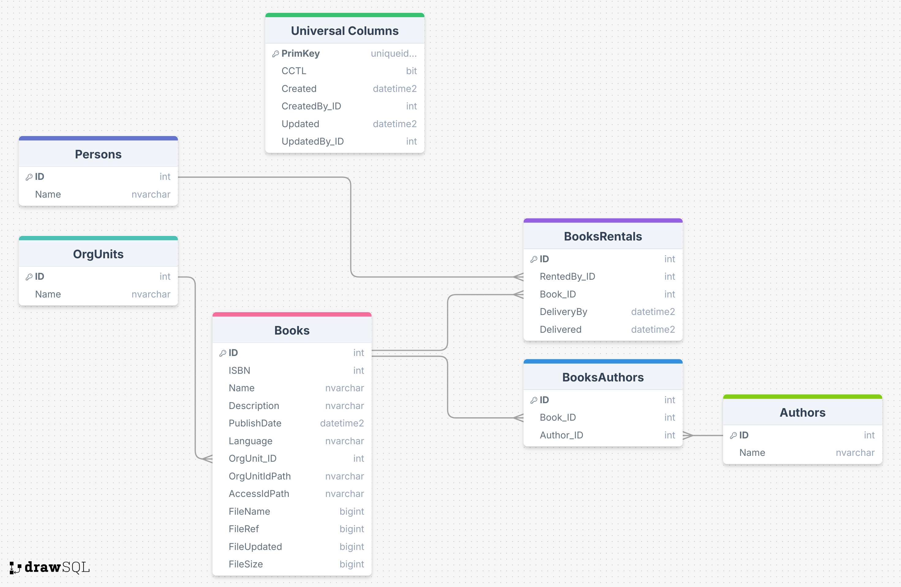

# Planlegging Fagprøve

25/03/2025 - 02/04/2025

## Målet med oppgaven:
Målet med denne oppgaven er å utvikle et biblioteksystem for en skole der lærere/elever kan låne og levere bøker, samt se status på dem. De ansatte ved biblioteket skal kunne legge til, redigere, og slette bøker.
## Påkrevt funksjonalitet og krav:
- **Applikasjonskomponenter**: Den skal støtte to typer brukere; lærer/elev og bibliotekansatt. Lærer/elev skal kunne låne, levere, og utvide lån, mens ansatt skal kunne legge til, redigere, og slette bøker. Om boken som ønskes lånt er allerede lånt, så skal det vise forventet dato der boken er ledig. Denne dataen skal lagres på server via sikret API.
- **Lagring**: Det skal lagres i database med tilgangstyring som passer på at bare ansatte kan redigere metadata og bøker.
- **Design**: Det skal være et tilgjengelig, intuitivt, og brukervennlig design for alle brukergrupper som følger kravene til universell utforming.
## Sjekkliste kjernefunksjonalitet:
- Lag datamodell ved bruk av DrawSQL
- Lag skisse av app ved bruk av Figma som designverktøy
- Lag et register for ansatte der de kan se alle bøker, legge til, og slette. De skal også kunne redigere metadata.
- Lag et grensesnitt hvor brukere kan lett søke etter bøker og låne dem, og se status på bøkene.
- Lage et register der brukeren kan se sine utlånte bøker, der de kan lett utvide lån og/eller levere inn igjen.
- Lag tilgangstyring som passer på forskjellige tilganger på brukere.

## Sjekkliste ekstrafunksjonalitet:
- Reservasjon system som gjør at selv om en bok er utilgjengelig, kan du reservere den når den er ledig igjen, slik at andre ikke kan låne den.
- Import av bøker via ISBNdb API slik at all metadata fylles automatisk.
- ISBNdb søkemodal, slik at om en bok skal opprettes kan det søkes gjennom ISBNdb for å finne boken.
- Sen leveringsgebyr, slik at det regner ut hvor mye en bruker må betale om de leverer sent.
- Mulighet til å filtrere på sjanger.
## Fremgangsmåte:
1. Jeg skal begynne ved å planlegge datamodellen, layout på app, og hvordan sikkerheten skal virke
2. Lage roller, moduler o.l.
3. Lage SQL Objekter
   - Tabeller og triggere
     - Books
       - ITrig: Standard sjekk på tilganger og at du er bibliotekar
       - UTrig: Standard sjekk på tilganger og at du er bibliotekar
       - DTrig: Standard sjekk på tilganger og at du er bibliotekar
     - BooksRentals
       - ITrig: Standard sjekk på tilganger og at boken ikke er utlånt
       - UTrig: Standard sjekk på tilganger og at bruker har lånt boken
       - DTrig: Ingen sletting skal skje grunnet historikk
     - BooksFiles
       - ITrig: Standard sjekk på tilganger og at du er bibliotekar
       - UTrig: Standard sjekk på tilganger og at du er bibliotekar
       - DTrig: Standard sjekk på tilganger og at du er bibliotekar
     - BooksAuthors
       - ITrig: Standard sjekk på tilganger og at du er biliotekar
       - UTrig: Standard sjekk på tilganger og at du er biliotekar
       - DTrig: Standard sjekk på tilganger og at du er biliotekar 
     - Authors
       - ITrig: Standard sjekk på tilganger og at du er bibliotekar
       - UTrig: Standard sjekk på tilganger og at du er bibliotekar
       - DTrig: Standard sjekk på tilganger og at du er bibliotekar
   - Views
     - aviw_Books for å joine frem metadata, som f.eks forfatter og eventuelle filer som medhører.
     - aviw_BooksRentals for å joine frem metadata, som f.eks den som låner og hvilken bok det er.
   - Procedures
     - astp_BorrowBook
     - astp_DeliverBook
     - astp_ExtendBorrow 
4. Lage apper visuelt etter layout plan
5. Legge til planlagt kjernefunksjonalitet i appen, som f.eks mulighet for bibliotekar å legge til, redigere, og slette bøker, og mulighet for bruker å låne, utvide, og levere tilbake bøker.
6. Finpusse og teste at all kjernefunksjonalitet er på plass.
7. Vurdere ekstra funksjonalitet og eventuelt implementer det.
8. Kjøre planlagt testing av app og lage test rapport.
9. Skriv systemdokumentasjon med "handover" info for neste utvikler.
10. Skriv brukerdokumentasjon om hvordan appen fungerer.
11. Lage presentasjon og test presenter for andre lærlinger.

## Skisse:

### Data model:

- Universal Columns: Standard kolonner som kommer i alle Omega365 CTP tabeller.
- Persons: en system tabell som kommer ferdig definert i et Omega365 instans, har en rad per bruker i systemet og lagrer diverse metadata som navn, epost etc.
- OrgUnits: en system tabell som kommer ferdig definert i et Omega365 instans, hjelper med tilgangsfordeling ved bruk av trestruktur.
- Authors: denne tabellen oppbevarer alle forfattere som finnes i systemet.
- Books: denne tabellen oppbevarer alle bøkene som finnes i systemet med diverse metadata.
- BooksRentals: denne tabellen er en historikk tabell som oppbevarer alle lån, med Foreign Key til Persons og Books.
- BooksAuthors: denne tabellen linker sammen Books og Authors slik at en bok kan ha flere forfattere.
- BooksFiles: her oppbevares bildet som tilhører boka, tanken er en 1:1 relasjon slik at hver bok bare har ett bilde.

### Grov skisse:

- bildet på bunn venstre er admin skjermbildet for bibliotekarer som lar deg legge til, redigere, og slette bøker.
- bildet til høyre for admin bildet er bildet som en vanlig bruker vil bruke der de kan søke opp bøker og låne dem. Her vises status på boken.
- Bildet på topp er skjermbildet som viser brukeren sine lånte bøker, med mulighet for å utvide lånet eller levere inn.
## Tidsskjema

    

        Tirsdag 25/03
    

    <ul>
        <li>Gjennomgang fagprøve - 1t</li>
        <li>Lage datamodell, layout, og skrive plandokument - 5t</li>
        <li>Begynne på å lage tabeller, views, og procedures - 1.25t</li>
        <li>Logging - 0.25t</li>
        <li>Levere plan - Før 17:00</li>
    </ul>

    

        Onsdag 26/03
    

    <ul>
        <li>Fortsette med tabellene, views, og procedures - 2t</li>
        <li>Begynne på appene sin kjernefunksjonalitet - 5.25t</li>
        <li>Logging - 0.25t</li>
    </ul>

    

        Torsdag 27/03
    

    <ul>
        <li>Fortsette med appene sin kjernefunksjonalitet (med forbehold om endring fra fagprøvenemnden) - 7.25t</li>
        <li>Logging - 0.25t</li>
    </ul>

    

        Fredag 28/03
    

    <ul>
        <li>Fullføre appene sin kjernefunksjonalitet (med forbehold om endring fra fagprøvenemnden) og beynne vurdering av ekstrafunksjonalitet - 7.25t</li>
        <li>Logging - 0.25t</li>
    </ul>

    

        Mandag 31/03
    

    <ul>
        <li>Fullføre appene sin kjernefunksjonalitet og vurdere ekstrafunksjonalitet - 7.25t</li>
        <li>Logging - 0.25t</li>
    </ul>

    

        Tirsdag 01/04
    

    <ul>
        <li>Ferdigstille appene - 2t</li>
        <li>Skriv dokumentasjon - 3t</li>
        <li>Utfør og skriv test rapport - 1.25t</li>
        <li>Lag presentasjon - 1t</li>
        <li>Logging - 0.25t</li>
    </ul>

    

        Onsdag 02/04
    

    <ul>
        <li>Ferdigstill presentasjon og presenter</li>
    </ul>

## Teknologi:
- Omega 365 CTP (Core Technology Platform)
  Grunnet innebygd sikkerhet og trygt API. Det er også bedriftens standard.
  - VueJS 3
  - Bootstrap 5.3
  - Microsoft SQL Server
- GitHub
  - For dokumentasjon som er lett å dele med andre
- DrawSQL
  - For visualisering av datamodell
- Figma
  - For skisse av layout på applikasjonen

## Kostnader:
- Timerate lærling: 155,-
  - Estimert total pris lærling: 6 arbeidsdager * 7.5 timer * 155 = 8137.50,-
- Basic Omega 365 Instans per måned:
  - Hosting: 8000,-
  - Lisens: 25000,-
  - Kost per bruker: 380,-
- Estimert total pris: 39 975,- + 380 * antall brukere

## Kilder:
- Tor Halvorsen Aasheim (faglig leder)
- [Vue Docs](https://vuejs.org/)
- [SQL Server Docs](https://learn.microsoft.com/en-us/sql/?view=sql-server-ver16)
- [Omega 365 Docs](https://docs.omega365.com)
- [Bootstrap 5.3 Docs](https://getbootstrap.com/docs/5.3)
- [Stack Overflow](https://stackoverflow.com/)
- [ChatGPT](https://chatgpt.com)