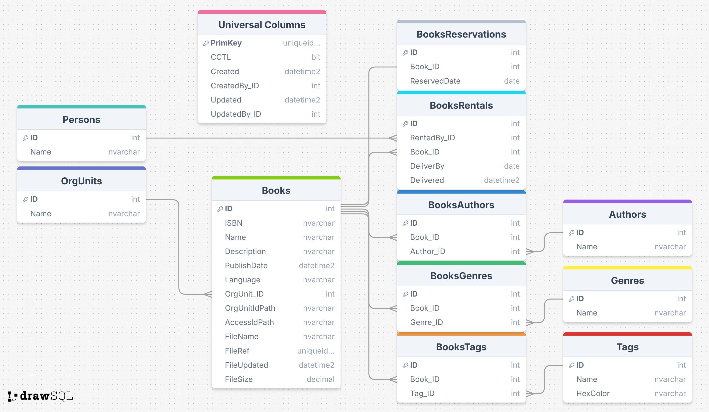
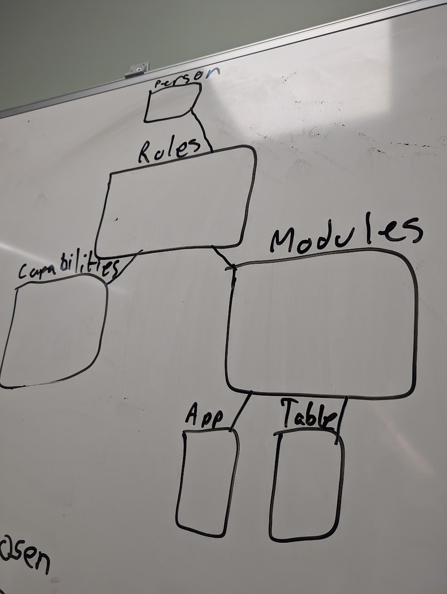
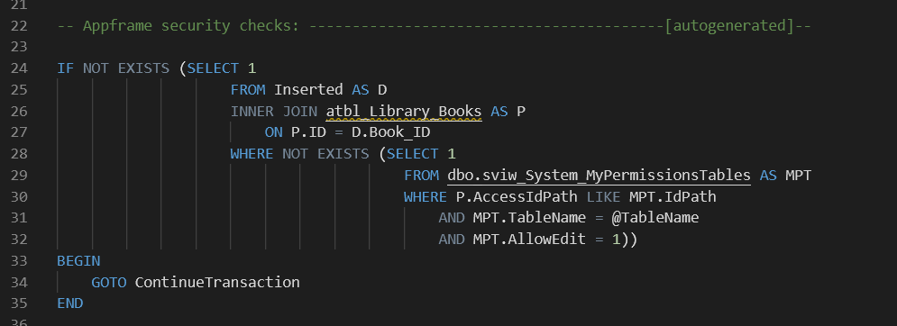
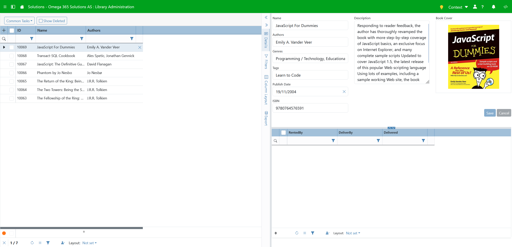
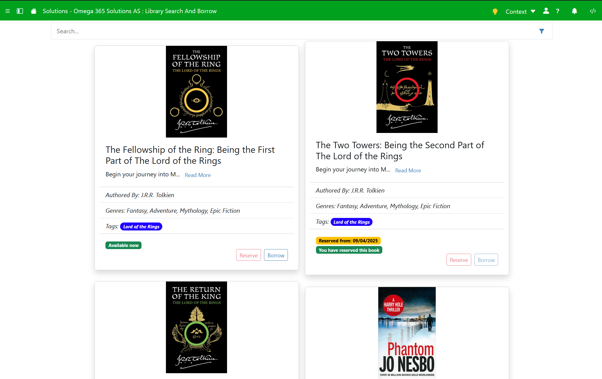
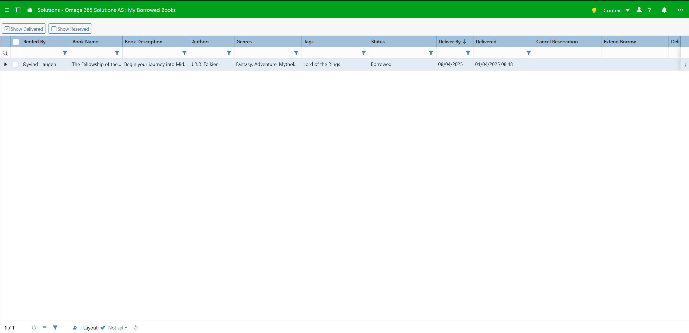

# System Dokumentasjon

Dette er systemdokumentasjonen til fagprøve oppgaven min som er å lage et skolebiblioteksystem. Her dekkes hvilke teknologier som blir brukt, hvordan datamodellen ser ut, hvordan sikkerheten fungerer, hvordan frontenden fungerer, hvilke problemstillinger som ble møtt må, planen videre, og hvilke avvik jeg gjorde fra den originale planen.

## Innhold
- Oppsummering applikasjon
- Teknologier
- Database modell
- Sikkerhet
- Frontend
- Problemstillinger
- Planen videre
- Avvik fra plan

    Oppsummering applikasjon

Oppgaven denne applikasjonen skal utføre er å være et fungerende skolebiblioteksystem der lærere/elever har tilgang til å låne, levere, utvide lån, og se status på bøker. Bibliotekarer skal kunne legge til, slette, og endre på eksisterende bøker.

    

        Teknologier
    

    <ul>
        <li>Omega 365 CTP</li>
        <li>Microsoft SQL Server</li>
        <li>Vue.js 3 med TypeScript</li>
        <li>Bootstrap 5.3</li>
        <li>ISBNdb API</li>
    </ul>

    

        Database modell
    

    
    
Datamodellen her er egentlig ganske selvforklarende og rett frem. Den består av 9 custom tabeller og 2 Omega 365 system tabeller.

    <small>FK - Foreign Key </small>
    

        
Tabeller

        <ul>
            <li>Books - dette er tabellen der alle bøkene er lagret med metadata som tittel, beskrivelse, ISBN og lignende.</li>
            <li>BooksRentals - dette er historikk tabellen der alle uttak og innleveringer blir registrert med FK til Books og Persons.</li>
            <li>BooksAuthors - dette er tabellen som linker forfattere til bøker med FK til Books og Authors.</li>
            <li>BooksGenres - dette er tabellen som linker sjangere til bøker med FK til Books og Genres.</li>
            <li>BooksTags - dette er tabellen som linker tags til bøker med FK til Books og Tags.</li>
            <li>BooksReservations - dette er køtabellen som registrerer reservasjoner på forkjellige bøker og personer med FK til Books og Persons.</li>
            <li>Authors - dette er tabellen der alle forfatterene er lagret.</li>
            <li>Genres - dette er tabellen der alle sjangerene er lagret.</li>
            <li>Tags - dette er tabellen der alle tags er lagret.</li>
            <li>Persons - dette er tabellen der alle brukere i Omega 365 instanset er lagret.</li>
            <li>OrgUnits - dette er tabellen der alle Orginisasjons enhetene er lagret. Eksempel på dette kan være en lokasjon eller et prosjekt, brukes sentralt i tilgangsstyring.</li>
        </ul>
    

    

        
Views

        <ul>
            <li>aviw_Books - view som henter ut metadata om bøker og joiner seg med linke tabellene for å hente ut data som navn på forfattere, tags, sjangere og lignende.</li>
            <li>aviw_BooksAuthors - view som henter ut spesifikk metadata for forfattere.</li>
            <li>aviw_BooksGenres - view som henter ut spesifikk metadata for sjangere.</li>
            <li>aviw_BooksRentals - view som henter ut alle utlån og innleveringer som er gjort.</li>
            <li>aviw_BooksTags - view som henter ut spesifikk metadata for tags.</li>
            <li>aviw_MyBorrowedBooks - view som henter ut hele lånehistorien til brukeren i tillegg til reservasjoner.</li>
        </ul>
    

    

        
Procedures

        <ul>
            <li>astp_BorrowBook - dette er prosedyren som kjøres når en bok skal lånes, tar inn Book_ID og mulig parameter for DayQuantity.</li>
            <li>astp_DeliverBook - dette er prosedyren som kjøres når en bok skal leveres inn, tar inn Book_ID.</li>
            <li>astp_ExtendBorrow - dette er prosedyren som kjøres når en bok skal ha utlånet sitt utvidet, tar inn Book_ID og DayQuantity.</li>
            <li>astp_ReserveBook - dette er prosedyren som kjøres når en bok skal bli reservert, tar inn Book_ID.</li>
            <li>astp_CancelReservation - dette er prosedyren som kjøres når en skal kansellere en reservasjon, tar inn Book_ID.</li>
            <li>astp_ImportBook - dette er prosedyren som kjøres når en bok importeres via ISBNdb APIet, tar inn BookJSON.</li>
        </ul>
    

    

        Sikkerhet
    

      
Hele løsningen støtter seg på sikkerheten i Omega 365 CTP. Kjernekonsept i sikkerheten er moduler, capabilities, og roller. En modul er som et tilgangskort som sier hva du ha tilgang til i.e. hvilke tabeller og apper du skal ha tilgang til. Roller kan da videre kobles opp til disse, men en rolle er ikke begrenset til bare en modul, den kan ha flere forskjellige, som blir som nøklene på et nøkkelknippe. En bruker kan få tildelt roller basert på hvilke tilganger de skal ha. Capabilities er "spesialtilganger" som blir gitt til noen individe roller for enda strengere sjekker. 

  
  
I Omega 365 CTP har vi flere måter å autentisere på, mest vanlig er SQL login eller Microsoft login. Med en SQL login som består av ett brukernavn og passord, kjøres ett sikkert API kall til SQL serveren for å autentisere brukeren. Med Microsoft login blir dette sendt til Microsoft og blir sjekket av dem. Om du blir autentisert av Microsoft returnerer de en token slik at Omega 365 vet at du er autentisert.

  
Utover dette er to faktor autentisering (2FA) høyst anbefalt. Det er flere forskjellige tilgjengelige valg som: SMS, Email, Time-based One Time Password (TOTP), og Passkey. SMS og Email blir generelt sett på som de minst sikre, men det er bedre enn ingen 2FA. TOTP er basert på engangskoder som kommer opp i apper som Microsoft Authenticator og Google Authenticater når du har registrert en side. Passkeys er et "passwordless" alternativ der innloggingen din er direkte koblet til en enhet du eier som f.eks telefonen din, og dette brukes for å verifisere at du er du.

  
Dette gjør det til ett lett oversiktlig system som kan tilpasses til mange forskjellige bruk.

  
Sikkerheten i views er egentlig ganske enkel siden den sjekker bare om du lesetilgang på tabellen. For økt sikkerhet har brukere aldri direkte tilgang til tabeller. I stedet brukes views, ofte via en atbv som er automatisk generert for alle nye tabeller. "atbv" står for Application Table View og brukes for å kontrollere hva en bruker kan se.

  
Sikkerheten i triggere er litt mer avansert, siden her må det sjekkes på om du har redigering/slette tilganger. På tabellene som relaterer til Books sjekker den at boken eksisterer og at du har tilganger til redigering og sletting på tabellen, men i Books tabellen skal det ikke skje noe sletting, siden da ville det ikke gått å oppbevare historikken for BooksRentals, så her kan det bli gjort en Soft Delete som bare setter et DateTime2 felt og filtreres vekk. Dette er sikkerheten de fleste prosedyrene henger seg på. 

  
All sikkerheten her ble skrevet med bruk av noe som heter SQL Templates, som gjør at du kan skrive en "template" og alle tabeller som oppfyller kravene får da den templaten i den autogenererte seksjonen. Dette sparer en del tid spesielt om du plutselig skal lage et par nye tabeller, eller vil gjøre endringer for mer enn en trigger/view

  
  
For biblioteksystemet har jeg satt opp to roller; Library Admin og Library User. Bibliotekarer får tildelt Admin rollen, og denne gir de redigeringstilgang på de fleste tabellene slik at de kan legge til, redigere, og "slette" bøker. Lærere/elever vil få tildelt Library User rollen, som da bare gir lesetilganger til de fleste tabellene utenom BooksRentals og BooksReservations der de har redigeringstilganger for å kunne låne, levere, og reservere.

    

        Frontend
    

    

        Denne løsningen består av 3 skjermbilder; Library Administration, Library Search And Borrow, og My Borrowed Books.
    

    <ul>
        
        <!--legg til bilder av hver app før/etter punktene-->
        <li>Library Administration - denne appen er der bibliotekarer kan legge inn nye bøker, redigere eksisterende bøker, eller "slette" bøker med bruk av soft delete. I denne appen er det også mulighet for å administrere alle eksisterende Tags, Genres, og Authors med modalene som ligger under Common Tasks. Her under Common Tasks finner du også "Import from ISBN" som er en modal som lar deg importere en bok fra APIet til ISBNdb ved å taste inn en ISBN. Denne integrasjonen fungerer for metadata som tittel, beskrivelse og forfatter, men ikke for cover bilde. Dette vises i modalen og der er det en hjelpetekst som forteller at bildet må lagres lokalt og lastes opp for å kunne vises. Denne begrensingen kommer pga. at integrasjonen er skrevet i frontend. Siden det er gjort slik så har nettleseren en innebydt sikkerhetsfunksjon som heter CORS(Cross-Origin Resource-Sharing) som sender "dummy" forespørsler av typen OPTIONS før de faktiske forespørselene av type GET. Endepunktet der bildene er lagret hos ISBNdb støtter ikke CORS så da er det desverre ikke mulig å hente bildet derifra, men "img" taggen sjekker ikke CORS, så bildet kan vises i modalen.  </li>
        
        <li>Library Search And Borrow - denne appen er der brukere går inn for å se bøker, låne, reservere, og se status på bøker. Her er det mulighet for å søke med søkebaren og filtrere sjanger med trakt symbolet vedsiden av.</li>
        
        <li>My Borrowed Books - denne appen er der brukere får opp en tabell over sine utlånte bøker, tidligere utlånte bøker, og reserverte bøker, med mulighet for å utvide lån, levere lån, og kansellere reservasjoner.</li>
         
         
        
Siden disse appen bruker Omega 365 CTP, håndteres mye av kommunikasjonen med SQL Server via et mellomlag ved hjelp av DataSources. Enkelt forklart er DataSources JSON-objekter som definerer et view. Disse sendes til .NET Core API-et for verifisering. Hvis verifiseringen godkjennes, sendes forespørselen videre til SQL Server. Ved å bruke dette konseptet håndterer API-et sikkerhetstiltak som beskyttelse mot SQL Injection, slik at dette ikke trenger å implementeres direkte i frontend.

        
I Library Administration brukes en DataGrid på venstresiden for rask navigasjon gjennom alle bøkene som finnes, med filtreringsmuligheter, og på høyresiden er et matchende detaljevindu som viser utvidet informasjon som tittel, beskrivelse, forfattere etc. Her er det også mulighet for å laste opp et bilde ved å dra en fil over, eller bare trykke på teksten i firkanten, så kommer en filvelger opp. Under all denne infoen ligger en Grid som viser lånehistorikken til denne boken. Her var det egentlig planer om å legge til en grid som viser om den er reservert og evnt hvem som har reservert, men dette ble det ikke tid til.

        
I Library Search And Borrow er det Cards som blir rendret basert på dataen i DataSourcen som reflekterer aviw_Books. Her lastes det bare inn et par til å starte med, men her kan en trykke "Load More" for å laste det neste settet med data i tillegg. Dette kalles dynamic loading, ellers kjent som Pagination. På hver av disse Card-ene er det to knapper; Reserve og Borrow. Disse er ganske selvforklarende. Reserve gir deg en popup som spør om du er sikkert på at du vil reservere boken, og etterpå får du en melding i appen som sier ditt nummer i køen. Borrow knappen åpner en modal som viser all infoen om boken litt større, med mulighet for å låne boken lenger enn standard 7 dager.

        
I My Borrowed Books er det en DataGrid som viser dataen fra aviw_MyBorrowedBooks med mulighet til å filtrere på om du ønsker å se tidligere lån og/eller reserverte bøker. I denne gridden er det knapper for å levere, utvide lån, og kansellere reservasjon.

        
Når en bok blir lånt blir det sendt et signal for å "refreshe" den raden, men for at Vue skal vite hvilket card den skal rerendre så har jeg gitt dem unike "keys", og da kan Vue lett gjenkjenne hvilken card som har endret seg og rerendre det spesifikke card-et.

    </ul>

    

        Problemstillinger under utvikling
    

    <ol>
        <li>ISBNdb API - det var litt vanskelig i starten å få denne integrasjonen til å fungere grunnet CORS (Cross-Origin Resource-Sharing), men til slutt fant jeg en fiks for dette for den hoved forespørselen som ber om metadata for boken, som var ved å bruke <strong>Fetch APIet</strong> istedenfor Omega 365 CTP sitt foretrukne <strong>API.request</strong> grunnet ekstra headere som blir satt på av Omega 365 CTP, som da dette endepunktet ikke aksepterte. Men når det kom til å hente ut omslaget til boken ble det problematikk siden dette endepunktet aksepterte ikke CORS headers, så gjorde at når en <em>preflight</em> forespørsel ble sendt, så ble hele forespørselen blokkert. Denne har jeg enda ikke funnet et måte rundt, så her ble løsningen at brukeren (bibliotekaren) må laste ned bildet som vises i importmodalen, for å så laste det opp igjen etter importen av metadataen er gjort. Her er det også et problem at siden denne ikke er skrevet i backend, så må API key oppbevares i frontend, som er et mulig sikkerhetshull.</li>
        <li>Author, Genre, og Tags Modal - her hadde jeg litt problemstilling i hvordan jeg burde plassere disse, siden rett i detaljevinduet ville det ikke vært plass. Så her endte jeg opp med å ha en "customizable" modal som rendret forskjellig basert på hvilke parameter den fikk inn. Dette viste seg å være en ganske grei løsning.</li>
    </ol>

    

        Planen videre
    

    <ul>
        
Her er tingene jeg hadde planlagt videre, men som jeg ikke fikk tid til:

        <li>Flytte integrasjonen til ISBNdb til backend</li>
        <li>Legge til mulighet for å bruke en scanner for å importere bøker</li>
        <li>Lookup til ISBNdb for rask og enkel måte å legge til bøker på</li>
        <li>Grid som viser hvem som har reservert boken</li>
        <li>Purregebyr og kalkulasjon om det</li>
        <li>Notifikasjoner angående lån som nærmer seg fristen</li>
        <li>En måte for bruker å ønske inn nye bøker, og et register for bibliotekar</li>
        <li>Integrasjon mot et API for rating av bøker</li>
        <li>Støtte for å kategorisere med Dewey Decimal</li>
    </ul>

    

        Avvik fra plan
    

    <ul>
        
Her er avvikene jeg har hatt fra den originale planen med begrunnelse:

        <li>Genre og Tags - disse la jeg til for å kunne lettere kategorisere bøker, ikke bare på forfatter. Eksempelvis om en bruker ikke helt vet hva de vil lese så kan de sette filter på en sjanger å se hva som kommer opp. Tanken med tags er f.eks for å kunne kategorisere serier som Harry Potter eller Lord of the Rings.</li>
        <li>ISBNdb import - for en bibliotekar er det veldig tungvinnt å legge til bøker manuelt, så en mulighet for å få mesteparten av metadataen inn automatisk er greit, derfor har jeg laget en integrasjon til ISBNdb der en kan hente ut denne metadataen.</li>
        <li>Reservasjonssystem - om en bruker ønsker å låne en bok som akkurat nå er det dumt om f.eks noen andre klarer å låne den før denne brukeren (etter den er levert). Derfor har jeg laget til et køsystem som lar brukeren legge seg i en reservasjonskø som da gjør det slik at bare den brukeren som ligger øvert i køen kan låne den etter den blir levert inn igjen.</li>
        <li>Badges istedenfor Available From tekst - her har jeg valgt å vise tidspunktene og statusene ved å bruke Badges, som jeg synes gjør det mye letter å forstå hva som skjer og hva eventuell status på boken er.</li>
    </ul>

