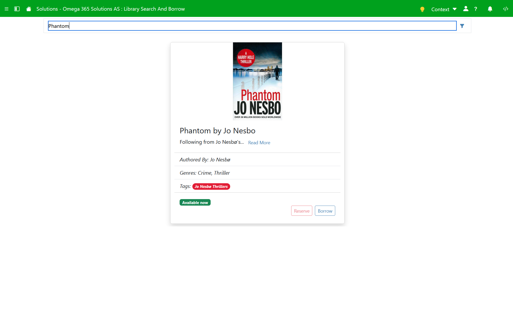
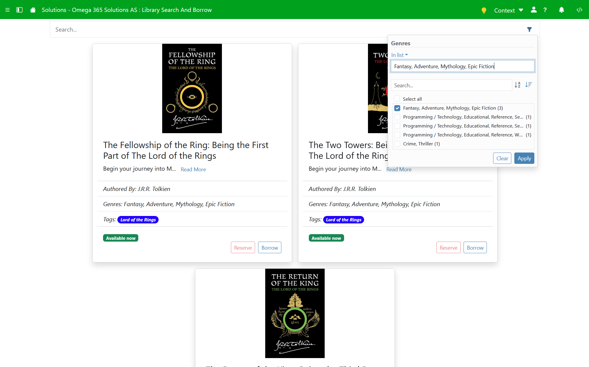
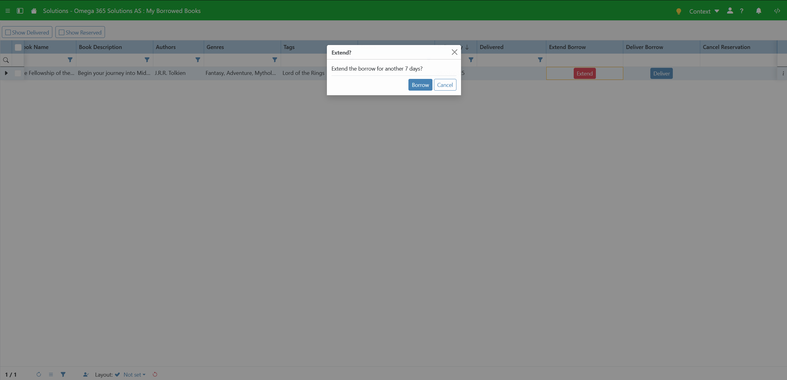
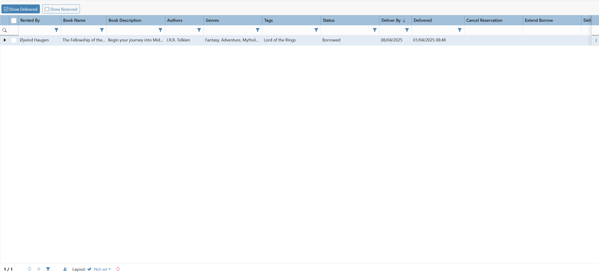
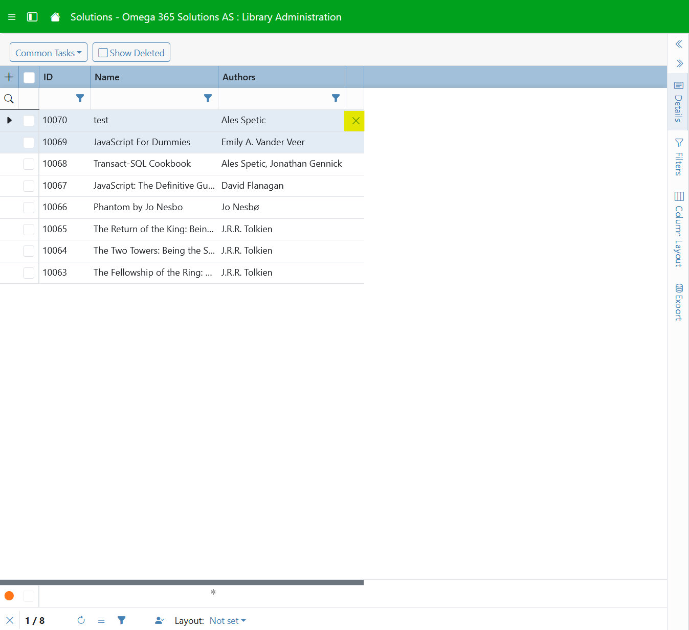
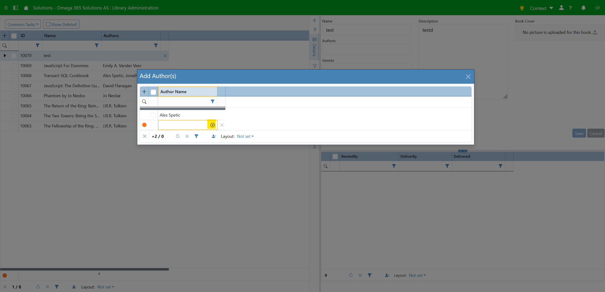
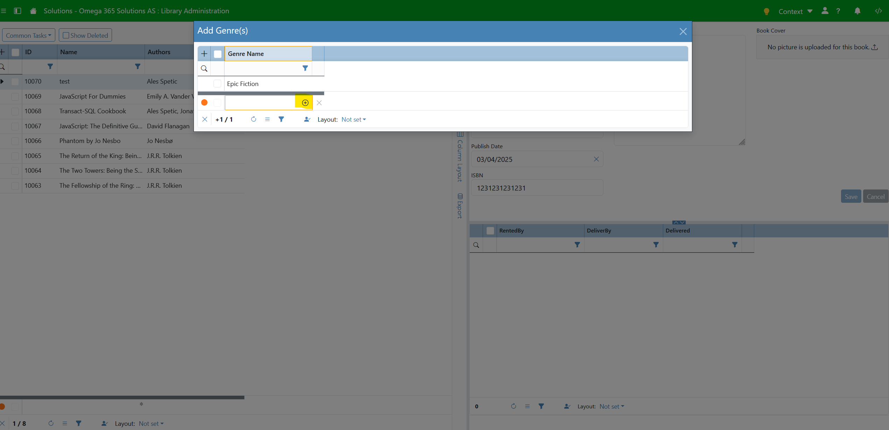
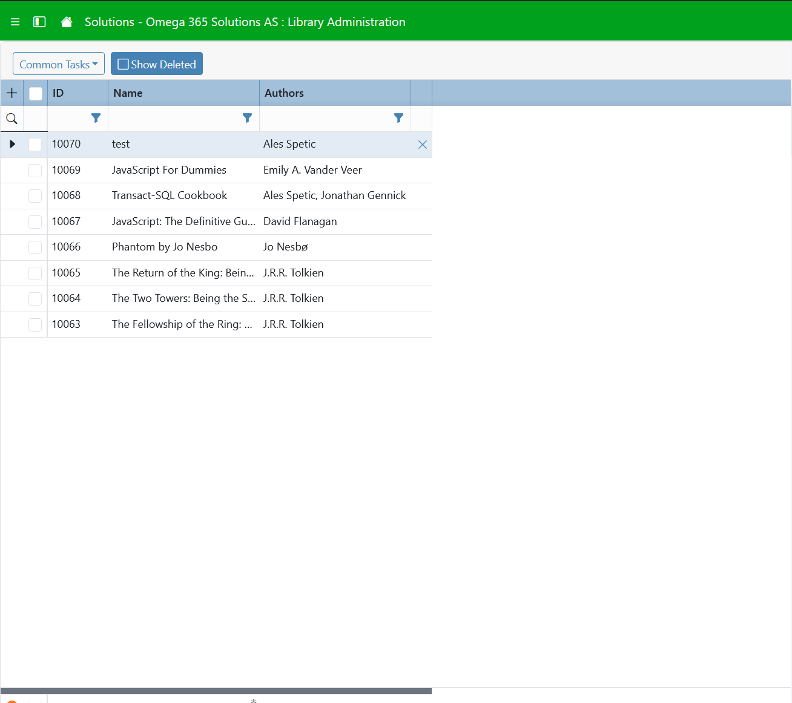
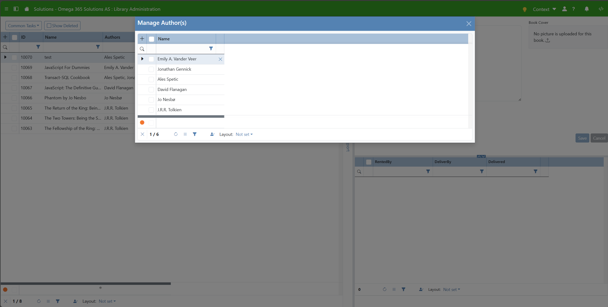
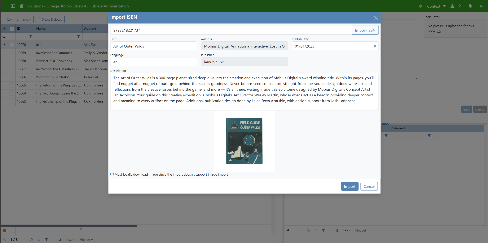

# Test Rapport

## Plan:
Utføre grundig test av alle funksjonene i appene og beskrive hvordan de burde oppføre seg, og om de ikke oppfører seg rett, dokumenter hva som ikke fungerer og eventuelle fikser.

### Library Search And Borrow
<table>
    <th>Funksjon</th>
    <th>Forventet oppførsel</th>
    <th>Resultat</th>
    <th>Bilde</th>
    <th>Eventuelle fikser</th>
    <th>Status</th>
    <tr>
        <td>Søke etter bøker</td>
        <td>Filtrere bøker basert på søkekriterie</td>
        <td>Filtrerer basert på søkekriterie</td>
        <td></td>
        <td></td>
        <td>✅</td>
    </tr>
    <tr>
        <td>Filtrere på sjanger</td>
        <td>Filtrere bøker basert på valge sjangere i filter byggeren</td>
        <td>Filtrerer basert på sjangere valgt i filter byggeren</td>
        <td></td>
        <td></td>
        <td>✅</td>
    </tr>
    <tr>
        <td>Les mer</td>
        <td>Vise hele beskrivelsen</td>
        <td>Viser hele beskrivelsen</td>
        <td></td>
        <td></td>
        <td>✅</td>
    </tr>
    <tr>
        <td>Reservere</td>
        <td>Legge til bruker i reservasjonskøen</td>
        <td>Legger bruker til i reservasjonskøen</td>
        <td></td>
        <td></td>
        <td>✅</td>
    </tr>
    <tr>
        <td>Låne på standard tid</td>
        <td>Låne boken til brukeren i 7 dager</td>
        <td>Låner boken til brukeren i 7 dager</td>
        <td></td>
        <td></td>
        <td>✅</td>
    </tr>
    <tr>
        <td>Låne på selvbestemt tid</td>
        <td>Låne boken til brukeren i det selvbestemte tidsrommet</td>
        <td>Låner boken til brukeren i det selvbestemte tidsrommet</td>
        <td></td>
        <td></td>
        <td>✅</td>
    </tr>
    <tr>
        <td>Last flere</td>
        <td>Laste det neste settet med bøker</td>
        <td>Laster det neste settet med bøker</td>
        <td></td>
        <td></td>
        <td>✅</td>
    </tr>
</table>

### My Borrowed Books
<table>
    <th>Funksjon</th>
    <th>Forventet oppførsel</th>
    <th>Resultat</th>
    <th>Bilde</th>
    <th>Eventuelle fikser</th>
    <th>Status</th>
    <tr>
        <td>Utvide lån</td>
        <td>Utvide lån med 7 dager</td>
        <td>Utvidet lånet med 7 dager</td>
        <td></td>
        <td></td>
        <td>✅</td>
    </tr>
    <tr>
        <td>Levere tilbake bok</td>
        <td>Levere bok tilbake</td>
        <td>Leverte boken tilbake</td>
        <td></td>
        <td></td>
        <td>✅</td>
    </tr>
    <tr>
        <td>Vis leverte bøker</td>
        <td>Vise leverte bøker i registeret</td>
        <td>Viste leverte bøker i registeret</td>
        <td></td>
        <td></td>
        <td>✅</td>
    </tr>
    <tr>
        <td>Vis reserverte bøker</td>
        <td>Vise reserverte bøker i registeret</td>
        <td>Viste reserverte bøker i registeret</td>
        <td></td>
        <td></td>
        <td>✅</td>
    </tr>
    <tr>
        <td>Kansellere reservasjon</td>
        <td>Kansellere en reservasjon på en bok</td>
        <td>Kansellerte reservasjonen på boken</td>
        <td></td>
        <td></td>
        <td>✅</td>
    </tr>
</table>

### Library Administration
<table>
    <th>Funksjon</th>
    <th>Forventet oppførsel</th>
    <th>Resultat</th>
    <th>Bilde</th>
    <th>Eventuelle fikser</th>
    <th>Status</th>
    <tr>
        <td>Legge til ny bok</td>
        <td>En ny bok legges til</td>
        <td>Boken ble lagt til</td>
        <td></td>
        <td></td>
        <td>✅</td>
    </tr>
    <tr>
        <td>Slette bok</td>
        <td>Boken blir slettet</td>
        <td>Boken ble slettet</td>
        <td></td>
        <td></td>
        <td>✅</td>
    </tr>
    <tr>
        <td>Redigere tittel, beskrivelse, publiseringsdato og ISBN</td>
        <td>Tittel, beskrivelse, publiseringsdato og ISBN blir redigert</td>
        <td>Tittel, beskrivelse, publiseringsdato og ISBN ble redigert</td>
        <td></td>
        <td></td>
        <td>✅</td>
    </tr>
    <tr>
        <td>Legge til forfattere</td>
        <td>Forfatter blir lagt til</td>
        <td>Forfatter ble lagt til</td>
        <td></td>
        <td></td>
        <td>✅</td>
    </tr>
    <tr>
        <td>Legge til sjangere</td>
        <td>Sjanger blir lagt til</td>
        <td>Sjanger ble lagt til</td>
        <td></td>
        <td></td>
        <td>✅</td>
    </tr>
    <tr>
        <td>Legge til tags</td>
        <td>Tag blir lagt til</td>
        <td>Tag ble lagt til</td>
        <td></td>
        <td></td>
        <td>✅</td>
    </tr>
    <tr>
        <td>Legge til bilde med klikk</td>
        <td>Bilde lastes opp fra filvelger</td>
        <td>Bildet ble lastet opp fra filvelger</td>
        <td></td>
        <td></td>
        <td>✅</td>
    </tr>
    <tr>
        <td>Legge til bilde med drag and drop</td>
        <td>Bilde lastes opp ved å dra en fil over</td>
        <td>Bildet ble lastet opp ved å dra en fil over</td>
        <td></td>
        <td></td>
        <td>✅</td>
    </tr>
    <tr>
        <td>Se lånehistorikk</td>
        <td>Hele lånehistorikken skal vises</td>
        <td>Hele lånehistorikken vises</td>
        <td></td>
        <td></td>
        <td>✅</td>
    </tr>
    <tr>
        <td>Vis slettede bøker</td>
        <td>Slettede bøker skal vises</td>
        <td>Slettede bøker blir vist</td>
        <td></td>
        <td></td>
        <td>✅</td>
    </tr>
    <tr>
        <td>Redigere forfattere</td>
        <td>Forfattere blir redigert</td>
        <td>Forfattere blir redigert, men sletting kommer an på om forfatteren står knyttet til en bok</td>
        <td></td>
        <td>Om sletting skal være absolutt så kan det settes på ON DELETE CASCADE for at dependencies blir slettet</td>
        <td>✅❌</td>
    </tr>
    <tr>
        <td>Redigere sjangere</td>
        <td>Sjangere blir redigert</td>
        <td>Sjangere blir redigert, men sletting kommer an på om Sjangeren står knyttet til en bok</td>
        <td></td>
        <td>Om sletting skal være absolutt så kan det settes på ON DELETE CASCADE for at dependencies blir slettet</td>
        <td>✅❌</td>
    </tr>
    <tr>
        <td>Redigere tags</td>
        <td>tag blir redigert</td>
        <td>tag blir redigert, men sletting kommer an på om taggen står knyttet til en bok</td>
        <td></td>
        <td>Om sletting skal være absolutt så kan det settes på ON DELETE CASCADE for at dependencies blir slettet</td>
        <td>✅❌</td>
    </tr>
    <tr>
        <td>Importere med ISBN</td>
        <td>Bok skal bli importert</td>
        <td>Boken blir importert</td>
        <td></td>
        <td></td>
        <td>✅</td>
    </tr>
</table>